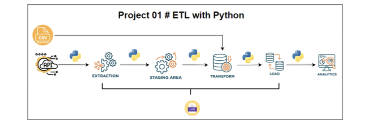

# ETL Project – Largest Banks Data Pipeline

This was my first ETL (Extract, Transform, Load) project in Python, where I learned how to collect data from a website, process it, and store it in different formats.

---

## 📌 Project Overview

This project extracts data about the world's largest banks by market capitalization from a Wikipedia webpage, transforms the data into multiple currencies using exchange rates, and loads the final processed data into both CSV and SQLite database formats.

---

# 🏗️ ETL Architecture



---

## 🔍 Extract Phase

In the extraction phase, data was scraped from a Wikipedia page using web scraping techniques.

### Technologies Used:
- `requests`
- `BeautifulSoup`
- `pandas.read_html()`

### Process:
- Fetch webpage content
- Parse HTML table
- Convert table into Pandas DataFrame

---

## 🔄 Transform Phase

In the transformation phase, market capitalization values were converted into different currencies using exchange rate data from a CSV file.

### Added Columns:
- `MC_GBP_Billion`
- `MC_EUR_Billion`
- `MC_INR_Billion`

### Technologies Used:
- `pandas`

---

## 📥 Load Phase

The transformed data was loaded into:
- CSV file
- SQLite Database

### Technologies Used:
- `sqlite3`

---

## 📊 SQL Queries Performed

The following queries were executed:
- Retrieve all bank records
- Calculate average market capitalization in GBP
- Display top 5 bank names

---

## 📝 Logging System

A logging system was implemented to track each ETL stage:
- Extraction completed
- Transformation completed
- Loading completed
- Query execution completed

Logs are stored in:

```bash
./logs/code_log.txt
